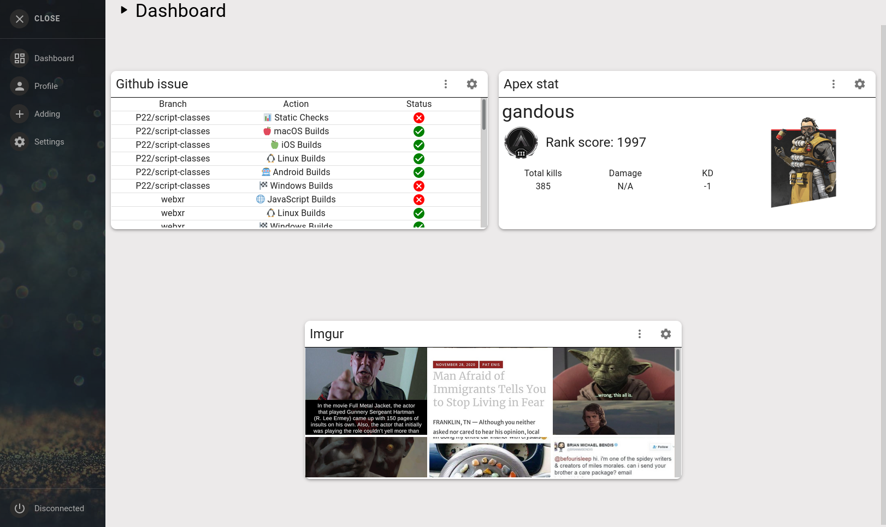
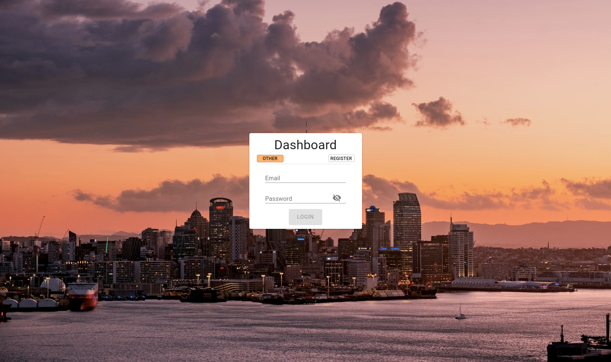
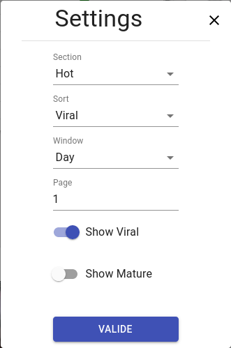
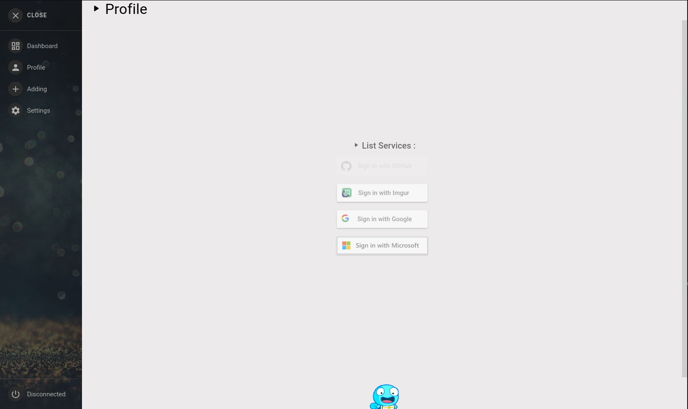

# React-Dashboard

# Purpose:
This is a Epitech Project in React Js.<br/>
the purpose of the application is to provide services (Twitch, Imgur, GitHub, Google) through the use of APIs.<br/>
Each service has dedicated Widgets.<br/>
<br/>
The Back was made in Go.<br/>
The DataBase is mySQL.<br/>
The project is dockerized.<br/>

## Look:
### Main Page
<p align="center">
<br/>
</p>

### Login Page
<p align="center">
<br/>
</p>

### Settings Page
<p align="center">
<br/>
</p>

### Oauth2 Services
<p align="center">
<br/>
</p>

## Usage:
- How to deploye with Docker:
```
docker-compose build; docker-compose up
```

## Documentation:
Go to see documentation:
[doc](./doc-img/user.md)


