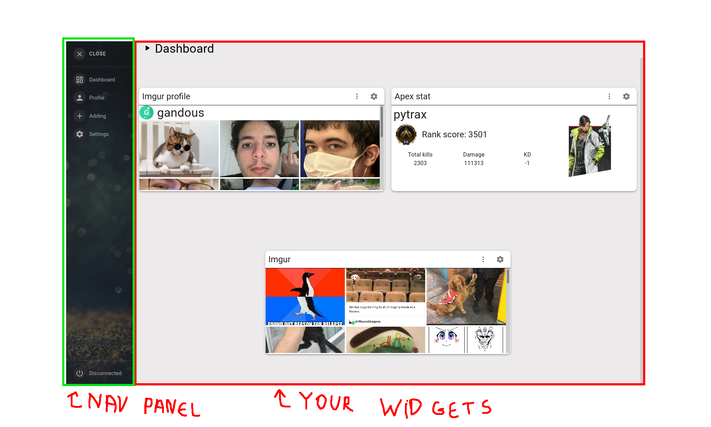
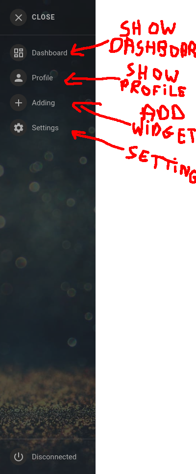
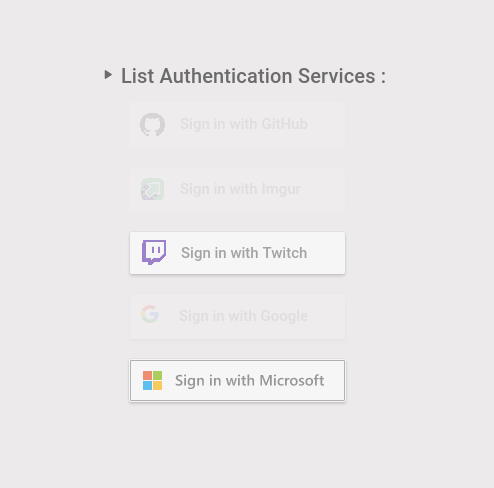
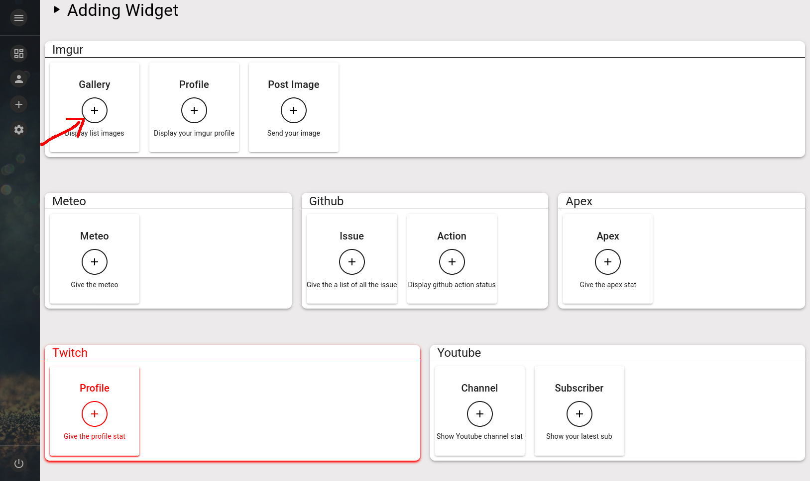
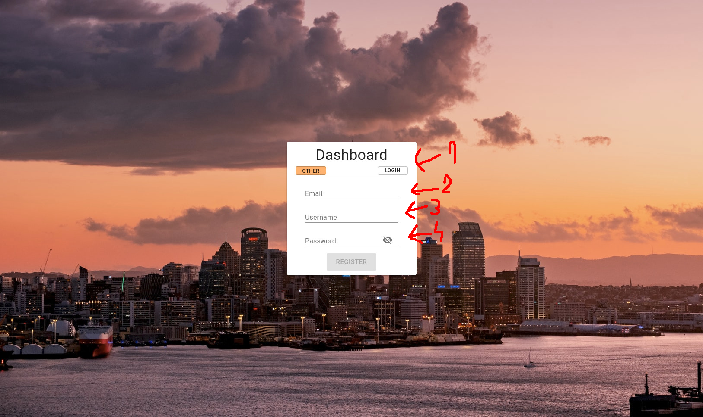
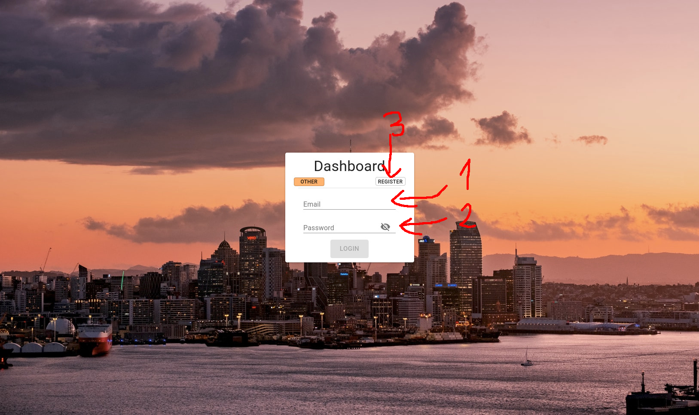
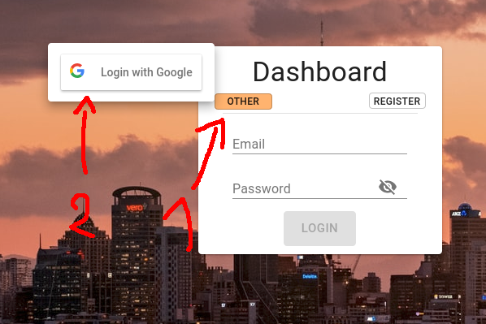

# User doc

## Dashboard page
The default page where you can see all your widget.\
On the left you can see the nav panel to switch between the different section

## Nav bar

## List of all the service you can login with

## Add screen
List all the widget you can add to your dashboard.\
To add a widget you need to click on the plus sign.\
If the widget is in red, that mean that you need to connect your acount of this service to get access to the widget.

## Register screen
1. Go back to login
2. Enter your email here
3. Enter your user name
4. Enter your password

## Login screen
### Login with email password
1. Enter your email
2. Enter your password
3. Go to register page

### Login with google
1. Click on the button show by 1
2. Click on login with google
